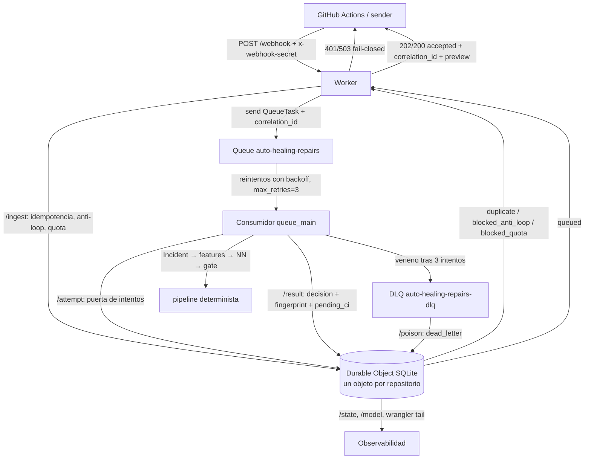

# PART 3 — Runtime Cloudflare (orquestador asíncrono)

> Worker = orquestador, **no** motor de cómputo. Coste objetivo: $0 (Workers Free).
> Actualizado: 2026-10-01 contra documentación oficial vigente (URL + fecha de consulta en §5).
> Código: `worker/` v0.2.0 (commit `c5fadd48`, rama `main`). Fuente de verdad del código: el repo, no este doc.

## 0. Reglas de autoridad (no negociables)

- Cloudflare: **ORCHESTRATES, PERSISTS, DEDUPLICATES, QUEUES, LIMITS, OBSERVES**.
- Cloudflare **NO** declara CI PASS, aprueba PR, fusiona PR ni declara éxito de producción.
- **GitHub Actions es la autoridad de VERIFY**: el Worker solo registra `verify_status: pending_ci`.
- Modelo: `current` → si falla → `stable` → si no hay → **BLOCKED**. Nunca `current failure → zeros → PASS`.
- Nunca retry infinito. Nunca declarar `DEPLOYED` sin evidencia real (ver §20).

## 1. Arquitectura

El webhook ya NO ejecuta el pipeline de forma síncrona. Flujo:

1. `POST /webhook`: valida el secret (fail-closed) y el body (payload parcial nunca rompe el isolate).
2. Calcula `correlation_id` e `idem_key` deterministas (FNV-1a 64).
3. Pregunta al Durable Object (`/ingest`): idempotencia → anti-loop → quota. Solo si el veredicto es `queued` encola.
4. Responde 200 con `status: accepted`, `correlation_id` y un `preview` determinista del gate (compatibilidad con el smoke test de `deploy.yml`, que exige `operator_id`).
5. El consumidor de la cola pide permiso (`/attempt`: hard-stop de intentos + anti-loop), ejecuta el pipeline determinista (features → NN → gate) y registra el resultado (`/result`: decisión, huella de parche, `verify_status=pending_ci`).
6. El veneno (3 intentos) cae a la DLQ; el consumidor de la DLQ lo registra (`/poison`) y asiente.

Hard stops efectivos: quota por incidente/repo/abierto/día, anti-loop por ventana (4 señales) y el hard stop de intentos del DO (`/attempt`, `max_attempts_per_incident`); el tope de reintentos del consumidor es `max_retries=3` + DLQ de la cola. La deduplicación y los bloqueos son transaccionales dentro del DO (single-threaded).

## 2. Diagrama



## 3. Servicios usados

| Servicio | Purpose | Benefit | Cost (Free) | Failure modes | Reason to use |
|---|---|---|---|---|---|
| **Workers** (workers-rs 0.8) | HTTP mínimo + consumidor de cola | CPU de 10 ms suficiente porque el webhook solo valida/encola | $0 | isolate reset, 50 subrequests | punto de entrada obligatorio del plano de control |
| **Durable Objects (SQLite)** | única pieza transaccional: dedup, idempotencia, quota, anti-loop, verificación | serialización por repositorio gratis (un objeto = un hilo) | $0 (Free: solo clases SQLite) | objeto evacuado/reset (el estado está en SQLite, sobrevive); límite de writes | sin serialización real no hay deduplicación robusta; KV no es transaccional |
| **Queues + DLQ** | trabajo asíncrono con reintento acotado | el webhook responde 202 y el pipeline corre fuera del request | $0 | ops/día limitadas, retención 24 h, mensaje venenoso | trabajo asíncrono con DLQ nativa y `max_retries` |
| **Workers KV (MODEL_KV)** | registro de pesos: current/stable/rollback | lectura global barata, promotion/rollback sin redeploy | $0 | eventual consistency (aceptable: los pesos cambian poco); 1k writes/día | el registro de modelo ya vivía aquí (enlace existente) |
| **Workers Logs (observability)** | invocaciones y errores con `wrangler tail` | correlación vía `correlation_id` en cada log | $0 | muestreo | OBSERVES es responsabilidad del runtime |

## 4. Servicios rechazados

No se introduce un servicio solo porque exista.

- **Workflows** (rechazado): sin soporte en workers-rs (la API oficial es JS/TS); duplicaría la cola; Free retiene instancias 3 días y cada paso consume CPU/sku de Workers; nuestro flujo es "un intento con reintentos acotados", no un flujo multi-día con esperas. Comparación completa en §10.
- **R2** (rechazado): no hay blobs que guardar. La evidencia de verificación es referencial (`evidence_ref` = run de Actions). Añadir 10 GB de almacenamiento de objetos aquí es infra sin consumidor.
- **D1** (rechazado): el estado es transaccional por repositorio; D1 es otra pieza de red sin serialización de entrada (habría que reimplementar los gates con transacciones optimistas). Los límites Free de filas son idénticos a los del DO SQLite.
- **Workers AI** (rechazado): prohibido por `docs/NO_LLM_POLICY.md` (ninguna ruta LLM ni generación libre de código). Los 10k neurons/día Free no cambian la decisión.

## 5. Límites oficiales (verificados 2026-10-01)

### 5.1 Límites de plataforma usados en el diseño

| Servicio | Límite (Workers Free) | Impacto arquitectónico | URL (consultada 2026-10-01) |
|---|---|---|---|
| Workers | 100.000 requests/día; 10 ms CPU/invocación; 128 MB; 50 subrequests | webhook síncrono mínimo + consumidor asíncrono | https://developers.cloudflare.com/workers/platform/limits/ |
| Durable Objects (SQLite) | 100.000 requests/día; 13.000 GB-s/día; 5M row reads/día; 100k row writes/día (SKUs de D1); 1 GB por objeto; 5 GB total Free; 100 clases/cuenta | un DO por repo; presupuesto de filas calculado en §16 | https://developers.cloudflare.com/durable-objects/platform/pricing/ y https://developers.cloudflare.com/durable-objects/platform/limits/ |
| Queues | 10.000 ops/día; retención 24 h; DLQ tras `max_retries` | cuello de botella global (§16); DLQ nativa | https://developers.cloudflare.com/queues/platform/pricing/ |
| KV | 100.000 reads/día; 1.000 writes/día; 1 GB | KV solo lectura en el camino caliente; promotion/rollback fuera de él | https://developers.cloudflare.com/kv/platform/pricing/ |

### 5.2 Límites de servicios rechazados (referencia)

| Servicio | Límite (Free, consultado 2026-10-01) | URL |
|---|---|---|
| D1 | 5M rows read/día; 100k rows written/día | https://developers.cloudflare.com/d1/platform/pricing/ |
| R2 | 10 GB storage; ops Class A/B mensuales | https://developers.cloudflare.com/r2/platform/pricing/ |
| Workers AI | 10.000 neurons/día | https://developers.cloudflare.com/workers-ai/platform/pricing/ |
| Workflows | 10.000 pasos/instancia (25.000 configurable); retención 3 días; 100 MB de estado/instancia | https://developers.cloudflare.com/workflows/reference/limits/ |

### 5.3 Fuentes de configuración verificadas (2026-10-01)

- Wrangler config (toml): https://developers.cloudflare.com/workers/wrangler/configuration/ — bindings, `[env.staging]`, migraciones de DO.
- Comandos de Wrangler: https://developers.cloudflare.com/workers/wrangler/commands/ — `deploy`, `dev`, `tail`, `rollback`, `deployments list`, `queues create`.
- Secrets: https://developers.cloudflare.com/workers/configuration/secrets/ — `wrangler secret put` (fail-closed: sin `WEBHOOK_SECRET` el webhook responde 503).
- Environments: https://developers.cloudflare.com/workers/wrangler/environments/ — staging aísla nombre, colas y namespace DO.
- Observability: https://developers.cloudflare.com/workers/observability/logs/ — `[observability] enabled = true`.
- workers-rs: https://github.com/cloudflare/workers-rs (v0.8.x activo) y https://docs.rs/worker/latest/worker/struct.SqlStorage.html — `#[durable_object]`, `sql()` síncrono, `#[event(queue)]`.

## 6. wrangler.toml

`worker/wrangler.toml` (sin cadenas `REPLACE_WITH` — el preflight de `deploy.yml` las bloquea):

- `name = "auto-healing-agent"`, `main = "build/worker/shim.mjs"`, `compatibility_date = "2024-09-23"`, `[build] command = "bash ./build.sh"`.
- `[observability] enabled = true`.
- `[vars]`: TODOS los valores configurables de quota y anti-loop (§11, §12) — config separada del estado, que vive en el DO.
- `MODEL_KV` con el id real del namespace: `73014a1b32b7446397461a8d438c8ab2`.
- `[durable_objects] bindings = [{ name = "INCIDENT_STATE", class_name = "IncidentState" }]` + `[[migrations]] tag = "v1" new_sqlite_classes = ["IncidentState"]` (SQLite-backed, disponible en Free).
- Colas: producer `REPAIR_QUEUE` → `auto-healing-repairs`; consumidor principal (`max_retries = 3`, `dead_letter_queue = "auto-healing-repairs-dlq"`, `max_concurrency = 1`); consumidor de DLQ (`max_retries = 1`).
- `[env.staging]`: Worker `auto-healing-agent-staging` con colas propias (`-staging`, `-dlq-staging`) y namespace DO aparte; comparte `MODEL_KV` (solo lectura).
- **Producción = entorno por defecto**: `deploy.yml` ejecuta `npx wrangler deploy` sin `--env`.

## 7. Worker (`worker/src/lib.rs`)

- Rutas: `GET /`, `GET /health`, `GET /model` (reporte del registro de modelo), `POST /webhook`, y `#[event(queue)] queue_main` (un solo handler para prod, staging y DLQ).
- Webhook: secret fail-closed (503 sin configurar, 401 con comparación en tiempo constante); body tolerante; `correlation_id` e `idem_key` FNV-1a; `/ingest` al DO; si el veredicto no es `queued` devuelve la misma decisión ya almacenada (200, el sender NO debe reintentar).
- Preview del gate: se calcula con `model::load` (current → stable → BLOCKED); si no hay modelo, el preview es `blocked_no_model` (sin `operator_id`).
- Compensación: si `queue.send` falla, registra `blocked` en el DO ANTES del 503 (nunca queda un incidente "queued" huérfano).

## 8. Durable Object (`worker/src/worker/incident_state.rs`)

- `#[durable_object]` `IncidentState`; un objeto por repositorio (`id_from_name(repo)`): serializa el estado del repo y hace triviales los contadores por repo.
- El lock es estructural: un DO es single-threaded; no hay condición de carrera entre `/ingest` concurrentes del mismo repo.
- Rutas: `/health`, `/ingest` (retención → idempotencia con TTL → anti-loop 4 señales → quota → alta), `/attempt` (puerta de intentos), `/result` (decisión + verificación + huella), `/poison` (DLQ), `/state` (observabilidad).
- Estados: `queued` → `repairing` → `done` | `blocked` | `dead_letter`. Cada transición lleva `correlation_id` y timestamp; el `from_state` es el estado REAL leído de la fila (antes venía hardcodeado a `repairing`).
- Guard de correlación: `/attempt`, `/result` y `/poison` verifican que la fila del incidente sigue perteneciendo a ese `correlation_id`. Si una entrega nueva del mismo incidente reemplazó la correlación (upsert de `/ingest`), el task obsoleto es denegado (`correlation_stale_or_missing`) en vez de escribir 0 filas «con éxito» y seguir hacia `verification`.
- La configuración NO vive aquí: llega en cada llamada desde las `[vars]` del Worker.

## 9. SQLite

Esquema real (adaptó el mínimo solicitado tras verificar el código):

- `incidents` (id, repository, signature, state, attempts, correlation_id, last_fingerprint, last_reason, created_at, updated_at) + índices por (repository, state) y updated_at.
- `idempotency` (key, response, created_at): respuesta exacta por entrega.
- `transitions` (incident_id, from_state, to_state, correlation_id, created_at): auditoría de cada cambio.
- `verification` (incident_id, status, evidence_ref, fingerprint, created_at): estado de VERIFY (`pending_ci` = GitHub Actions).
- `signature_events`, `fingerprints`, `repair_events`: ventanas temporales para anti-loop y quota (con índices compuestos).
- Retención: `/ingest` purga `idempotency` según el TTL del contrato (24 h) y las tres tablas de eventos a los 7 días (solo alimentan ventanas de 15 min / 1 h / 1 día). `transitions` es auditoría y NO se purga. Sin retención el DO crecería sin bound (1 GB por objeto).
- El esquema es idempotente (`IF NOT EXISTS`) y se prepara en el constructor del DO.
- Presupuesto de filas: ver §16.

## 10. Queue / DLQ (`worker/src/worker/queue_consumer.rs`)

- **Nunca retry infinito**: el tope de reintentos es `max_retries=3` de la cola (al superarse, el mensaje cae a la DLQ). El hard stop por NÚMERO DE INTENTOS es el DO (`/attempt`, `max_attempts_per_incident`): el 4º `/attempt` del incidente se deniega.
- No hay «contador propio» en el consumidor: el body del mensaje es inmutable al reintentar, así que un contador en el `QueueTask` nunca avanzaba entre redeliveries (la rama era inalcanzable y se eliminó). Los intentos REALES viven en el DO.
- Reintento por fallo transitorio: delay fijo de 10 s (`retry_with_options`).
- Veneno: registra `dead_letter` + `verification.status = poison` en el DO y hace `ack` del mensaje.
- Consumidor de DLQ: registra el veneno (best-effort) y `ack_all`.
- `correlation_id` SIEMPRE presente en cada `QueueTask`; idempotencia: la puerta `/attempt` del DO decide si un intento procede (un duplicado no consume quota dos veces).

**Queue vs Workflows (decisión)**:

| Criterio | Queues | Workflows |
|---|---|---|
| Soporte en workers-rs | Sí (feature `queue`, `#[event(queue)]`) | No (API JS/TS) |
| Modelo de cómputo | handler corto por mensaje | pasos con estado persistido por instancia |
| Retry | `max_retries` + DLQ + backoff propio | por paso, en código |
| Retención Free | mensajes 24 h | instancias 3 días |
| Coste Free | 10k ops/día | pasos + requests de Workers + storage |
| Encaje con PART3 | síncrono corto, reintento acotado, veneno → DLQ | un flujo multi-paso que no necesitamos |

Decisión: **Queues**. Nuestro caso es un intento acotado con backoff, no un flujo de días. Workflows quedará re-evaluado solo si el pipeline gana esperas largas (p. ej. esperar la review humana de un PR) y cuando workers-rs lo soporte.

## 11. Quotas (`worker/src/worker/quota.rs`)

Vars (`[vars]`, defaults en código): `QUOTA_MAX_ATTEMPTS_PER_INCIDENT=3`, `QUOTA_MAX_REPAIRS_PER_REPO=10`, `QUOTA_MAX_OPEN_REPAIRS=3`, `QUOTA_COOLDOWN_SECONDS=3600`, `QUOTA_DAILY_BUDGET=50`.

- Config separada del estado: los valores viven en `[vars]`; el estado contable (cuántos intentos/abiertos/rep araciones lleva cada repo) vive en el DO.
- `evaluate()` es una función pura sobre `QuotaUsage` → `Blocked(reason)` con el nombre exacto del límite.
- Parseo fallido → default (fail-safe, nunca fail-open).
- `daily_budget` se cuenta por día UTC (`repair_events.day`); `max_repairs_per_repo` dentro de la ventana de cooldown.

## 12. Anti-loop (`worker/src/worker/anti_loop.rs`)

Detecta, dentro de una ventana (`ANTI_LOOP_WINDOW_SECONDS=900` por defecto):

- mismo incidente (`ANTI_LOOP_MAX_SAME_INCIDENT=3`),
- misma firma de fallo (`ANTI_LOOP_MAX_SAME_SIGNATURE=5`),
- misma huella de parche (`ANTI_LOOP_MAX_SAME_FINGERPRINT=2`),
- misma verificación fallida (`ANTI_LOOP_MAX_SAME_FAILING_VERIFICATION=3`),

y produce **BLOCKED** (`blocked_anti_loop`) al exceder cualquier límite, con el motivo registrado. Señales en `/ingest` (las 4) y en `/attempt` (firma, huella, verificación): la huella de la entrega vigente se mide contra la última huella registrada del incidente (`incidents.last_fingerprint`, alimentada por `/result`); la verificación fallida se mide sobre la tabla `verification` (estados `blocked`/`poison`). `evaluate()` pura + tests por señal.

## 13. Idempotencia

- `idem_key = repair_types::compute_idempotency_key(repo, incident_id, delivery_id, fingerprint)` = FNV-1a(repo | incident | delivery | fingerprint): la fórmula CANÓNICA de CONTRACT.md §5 (antes el worker usaba una fórmula propia distinta y la función del contrato estaba sin usar). Sin delivery id usa el incident id.
- El DO guarda la respuesta EXACTA en `idempotency` con su `created_at`: una redelivery obtiene la misma decisión (200) sin reprocesar ni consumir quota. Con **TTL** (CONTRACT.md §5, `IDEMPOTENCY_TTL_SECONDS` = 24 h): una decisión guardada expira y la entrega se reprocesa; `/ingest` purga además las filas caducadas.
- Las decisiones bloqueadas también se guardan: reintentar una entrega bloqueada no revive el bloqueo.
- El consumidor es idempotente por diseño: `/attempt` incrementa `attempts` en el DO; un intento duplicado topa con el hard-stop de `max_attempts_per_incident`.

## 14. Seguridad (evaluación del protocolo)

El protocolo **NO se cambió**: `x-webhook-secret` con secreto compartido. Lo que se endureció:

| Mecanismo | Adoptado | Justificación |
|---|---|---|
| Comparación en tiempo constante | **Sí** | `constant_time_eq` acumula XOR de todos los bytes sin ramas dependientes del contenido. |
| Delivery ID + idempotencia | **Sí** | el replay de una misma entrega devuelve la misma respuesta y no consume quota. |
| Fail-closed | **Sí** | sin `WEBHOOK_SECRET` → 503; header ausente/incorrecto → 401. |
| HMAC del cuerpo | No | cambiar el protocolo rompe los senders existentes (`deploy.yml`, Actions) y exige coordinación de claves; el secreto compartido ya autentica al sender autorizado. Queda como endurecimiento futuro de P1 (decisión explícita, no unilateral de P3). |
| Timestamp + replay window | No | un timestamp sin firma (HMAC) es texto no verificable; la idempotencia por delivery-id ya acota el efecto del replay. |

La evaluación y esta decisión quedan registradas aquí; cualquier cambio de protocolo requiere justificar el impacto en todos los senders.

## 15. Rollback del modelo

Registro en `MODEL_KV`: `model/current`, `model/stable`, `model/rollback`.

- `model::load()`: current → stable → `Err` (**BLOCKED`). Un payload malformado invalida la clave entera (nunca pesos desplazados, nunca red de ceros).
- Promoción (P4): `wrangler kv key put model/current` con el candidato; `model/stable` = último conocido bueno; `model/rollback` = el que reemplazó.
- `GET /model`: declara el estado de los tres punteros, la política (`current -> stable -> BLOCKED (zeros forbidden)`) y que VERIFY = GitHub Actions. No expone pesos.
- Rollback del Worker (despliegue): `wrangler rollback` (§17).

## 16. Cálculo Free-tier (por incidente feliz, 1 intento)

| Recurso | Uso por incidente | Límite Free | Techo diario |
|---|---|---|---|
| Queue ops | ~3 (1 send + entrega + ack) | 10.000/día | **~3.300 incidentes/día ← cuello de botella** |
| SQLite row writes | ~10 (ingest 4 + attempt 2 + result 3–5) | 100.000/día | ~10.000 |
| SQLite row reads | ~10 (counts + selects) | 5.000.000/día | ~500.000 |
| DO requests | 3 (ingest, attempt, result) | 100.000/día | ~33.000 |
| Workers requests | ~2–3 (webhook + consumidor) | 100.000/día | ~33.000–50.000 |
| Subrequests | 2–3 por invocación (muy por debajo) | 50/invocación | sin riesgo |
| KV reads | ~2 (current y a lo sumo stable) | 100.000/día | ~50.000 |
| KV writes | 0 en el camino caliente | 1.000/día | — |
| Estado almacenado | ~2–4 KB por incidente | 1 GB/objeto, 5 GB total | cientos de miles |

Con `QUOTA_DAILY_BUDGET=50` y `QUOTA_MAX_REPAIRS_PER_REPO=10` el uso real queda órdenes de magnitud por debajo de todos los límites Free. El cuello teórico (Queues, ~3.300 incidentes/día) es irrelevante con budget 50/día.

## 17. Comandos (reproducibles)

```bash
cd worker

# 1. Colas (una vez por cuenta; deben existir ANTES del deploy)
npx wrangler queues create auto-healing-repairs
npx wrangler queues create auto-healing-repairs-dlq
npx wrangler queues create auto-healing-repairs-staging
npx wrangler queues create auto-healing-repairs-dlq-staging

# 2. Secret del webhook (fail-closed: sin él, /webhook responde 503)
npx wrangler secret put WEBHOOK_SECRET
npx wrangler secret put WEBHOOK_SECRET --env staging

# 3. Desarrollo local
npx wrangler dev

# 4. Staging
npx wrangler deploy --env staging
npx wrangler tail auto-healing-agent-staging

# 5. Producción (entorno por defecto; lo que ejecuta deploy.yml)
npx wrangler deploy
npx wrangler tail auto-healing-agent

# 6. Despliegues y rollback del Worker
npx wrangler deployments list
npx wrangler rollback auto-healing-agent

# 7. Registro de modelo (promoción / rollback de pesos; P4)
npx wrangler kv key put model/current --binding MODEL_KV --namespace-id 73014a1b32b7446397461a8d438c8ab2 --path pesos_candidato.txt
npx wrangler kv key put model/stable --binding MODEL_KV --namespace-id 73014a1b32b7446397461a8d438c8ab2 --path pesos_conocido_bueno.txt
npx wrangler kv key put model/rollback --binding MODEL_KV --namespace-id 73014a1b32b7446397461a8d438c8ab2 --path pesos_anterior.txt
npx wrangler kv key get model/current --binding MODEL_KV --namespace-id 73014a1b32b7446397461a8d438c8ab2
```

`wrangler kv key put ...` con valor literal requiere el secret real; con `--path` evita poner los 2.863 pesos en la línea de comandos.

## 18. Tests

```bash
cargo check --manifest-path worker/Cargo.toml --all-targets
cargo check --manifest-path worker/Cargo.toml --target wasm32-unknown-unknown --release
cargo test --manifest-path worker/Cargo.toml
```

- Unit tests incluidos en el código: `security` (constant_time_eq, vectores FNV-1a, urlencode), `quota` (evaluate por límite, fallback de parseo), `anti_loop` (cada señal por separado).
- CI (`.github/workflows/ci.yml`, job `worker`) ejecuta exactamente los dos `cargo check` (host + wasm32) en cada push/PR a `main`.
- El código NO se compiló en la sesión que lo escribió (sin toolchain local): **CI es la autoridad de compilación**. Mientras el job `worker` no esté verde, nada del runtime está verificado.

## 19. Dependencias P1 / P3 / P4

- **P1 (crates/ — NO modificado)**: `repair_types`, `feature_engine`, `repair_nn_core`, `repair_operators` se consumen como path deps desde `worker/Cargo.toml`; el worker ya no redeclara sus structs.
- **P1 (.github/workflows/deploy.yml — NO modificado)**: el preflight exige secrets reales y `worker/wrangler.toml` sin `REPLACE_WITH` (resuelto en `c5fadd48`). Su smoke test exige `operator_id` en la respuesta del webhook: el `preview` lo cubre **solo si** `model/current` o `model/stable` existen en KV; sin modelo el preview es `blocked_no_model` y el smoke test fallará — fallo honesto, no se simula inferencia.
- **P3 (este doc + worker/**)**: runtime asíncrono completo en `c5fadd48`; este documento es su especificación.
- **P4 (persistencia transversal)**: consume el registro de modelo (`model/current|stable|rollback`) y el estado del DO (`/state`, `verification`) como fuente de RepairCases; la promoción de pesos es un proceso P4 que escribe en KV (comandos §17).

## 20. Estado: **BLOCKED** (no declarar DEPLOYED)

Bloqueado por, en orden:

1. Faltan los secrets de GitHub `CLOUDFLARE_API_TOKEN` y `CLOUDFLARE_ACCOUNT_ID` (`deploy.yml` falla en preflight).
2. Faltan crear las 4 colas en la cuenta Cloudflare (§17.1).
3. Falta `WEBHOOK_SECRET` como secret del Worker (el webhook responde 503 hasta entonces).
4. Falta `model/current` o `model/stable` en `MODEL_KV` para que el smoke test del pipeline pase.
5. Verificación de compilación pendiente: el job `worker` de CI debe estar verde en `c5fadd48` (y en el commit de este doc).

Nada de esto se simula ni se declara. Cuando existan credenciales reales y CI verde, el estado pasa a **READY** y `npx wrangler deploy` (o el `workflow_dispatch` de `deploy.yml`) produce la evidencia real (URL pública + `wrangler deployments list`).


---

## DevOps: matriz build/deploy y pipeline de staging (2026-10-02)

> Sección añadida por el PR de DevOps (instrucción explícita del dueño:
> "PR devops para el repo"). Fuentes oficiales consultadas el 2026-10-02:
> Workers Builds – Configuration
> (https://developers.cloudflare.com/workers/ci-cd/builds/configuration/),
> Build branches (https://developers.cloudflare.com/workers/ci-cd/builds/build-branches/),
> Wrangler – Environments (https://developers.cloudflare.com/workers/wrangler/environments/).

### Matriz de rutas build → deploy

| Ruta | Trigger | Build | Deploy | Estado |
|---|---|---|---|---|
| Workers Builds (dashboard) | push a main / PR | `build.sh` raíz → `worker/build.sh` (`worker-build --release`) | `npx wrangler deploy` | Rojo en 0s: configuración del dashboard, no del código (ítem 56) |
| `deploy.yml` | `workflow_dispatch` | wrangler (working-directory `worker`) | `npx wrangler deploy` | No verificado sin credenciales (GOVERNANCE: sin auto-deploy) |
| `deploy-staging.yml` (nuevo) | `workflow_dispatch` | ídem | `npx wrangler deploy --env staging` | No verificado sin credenciales |

Ambos scripts de build son CWD-independientes (PR #14): Workers Builds funciona
con Root directory = raíz del repo **o** `worker`. La recomendación se mantiene
`worker`: ahí viven `Cargo.toml`, `wrangler.toml` y `build.sh`, y el shim
`build/worker/shim.mjs` se resuelve sin depender del `cd` del envoltorio.

### Workers Builds: settings exactos recomendados

- Root directory: `worker`
- Build command: `bash build.sh` (el default `npx wrangler deploy` no sirve
  para workers-rs: el build lo hace `worker-build`)
- Deploy command: `npx wrangler deploy`
- Branch de producción: `main`; previews automáticos en PRs (Build branches).

### Runbook de staging

1. Crear en Cloudflare las colas que referencia `[env.staging]` de
   `worker/wrangler.toml`: `auto-healing-repairs-staging` y
   `auto-healing-repairs-staging-dlq` (el deploy de un consumer no crea colas).
2. GitHub Settings → Environments → `staging`: añadir secrets
   `CLOUDFLARE_API_TOKEN`, `CLOUDFLARE_ACCOUNT_ID`, `WEBHOOK_SECRET`
   y la var `WORKER_URL_STAGING` (URL de `auto-healing-agent-staging`).
3. Actions → "Deploy Worker (Staging)" → Run workflow (input `note` obligatorio).
4. El smoke test integrado valida: `/health` 200, `/webhook` sin secret NO 200
   (fail-closed), `/webhook` con secret responde con `operator_id`.
   Sin `WORKER_URL_STAGING` el smoke se omite con un notice, no falla.

### Estado de checks conocidos (no regresiones de este PR)

- `verify` (Consistency): rojo por `BRANCH_DRIFT` mientras existan las ramas
  residuales `fix/root-build-cd-worker` / `fix/worker-build-cwd` (ya mergeadas
  en main; borrado manual del dueño + re-run).
- `workspace-fmt`: advisory (deuda de formato, ítem 34).
- `Workers Builds`: rojo en 0s, antes de ejecutar build command = settings del
  dashboard (ítem 56), no del código.
- `Kilo Code Review`: créditos de la cuenta (ítem 57).
